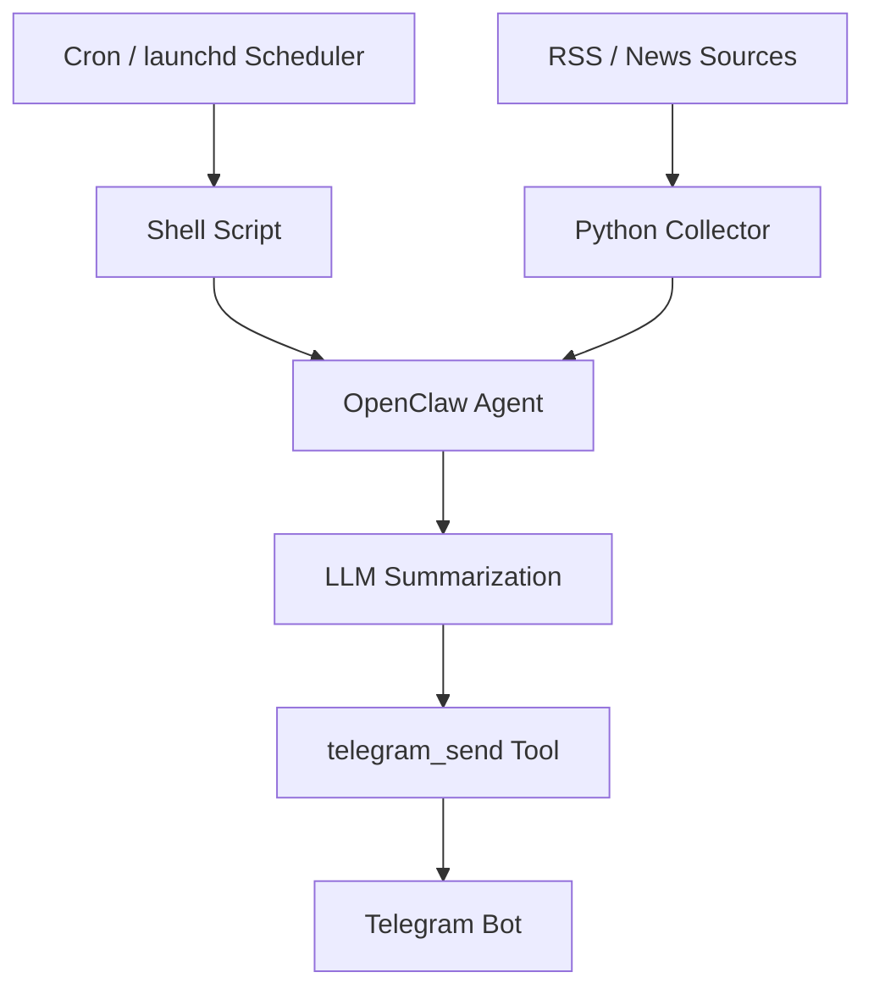

ai-daily-bot/
├─ README.md
├─ LICENSE
├─ .gitignore
├─ install.sh
├─ requirements.txt
├─ scripts/
│  ├─ ai_daily_report.sh
│  └─ ai_weekly_report.sh
├─ prompts/
│  ├─ ai_daily_prompt.md
│  └─ ai_weekly_prompt.md
├─ tools/
│  └─ telegram_send.json
├─ config/
│  ├─ env.example
│  └─ sources.yaml
├─ docs/
│  ├─ architecture.md
│  ├─ architecture.mmd
│  └─ roadmap.md
├─ src/
│  └─ ai_daily_bot/
│     ├─ __init__.py
│     ├─ collector.py
│     ├─ formatter.py
│     └─ runner.py
└─ .github/
   └─ workflows/
      ├─ ci.yml
      └─ release.yml

--------------------------------------------------
README.md
--------------------------------------------------
# AI Daily Bot

Automatically generate and deliver an **AI Daily Report** to **Telegram** using **OpenClaw + scheduled automation**.

This upgraded version supports:

- AI Daily Report
- AI Weekly Report
- Multi-source collection (RSS / custom URLs)
- Clean Telegram-friendly formatting
- Future-ready multi-channel delivery

## Features

- Collect recent AI news from configurable sources
- Summarize with LLM into concise daily and weekly digests
- Send to Telegram with `telegram_send`
- Ready for cron / launchd scheduling
- CI checks for shell + Python
- Roadmap for Slack / Feishu / Email expansion

## Architecture


## Quick Start

```bash
git clone https://github.com/YOURNAME/ai-daily-bot.git
cd ai-daily-bot
./install.sh

export TELEGRAM_BOT_TOKEN=YOUR_TOKEN
export TELEGRAM_CHAT_ID=YOUR_CHAT_ID
export OPENCLAW_GATEWAY_TOKEN=123456

./scripts/ai_daily_report.sh
```

## Daily Schedule

```bash
crontab -e
```

Add:

```bash
0 9 * * * /PATH/ai-daily-bot/scripts/ai_daily_report.sh >> ~/ai_daily.log 2>&1
```

## Weekly Schedule

```bash
0 10 * * 1 /PATH/ai-daily-bot/scripts/ai_weekly_report.sh >> ~/ai_weekly.log 2>&1
```

## Repo Structure

```text
ai-daily-bot
├── scripts        # shell entrypoints
├── prompts        # LLM prompts
├── tools          # OpenClaw tool specs
├── config         # env + source config
├── src            # Python helpers
├── docs           # architecture + roadmap
└── .github        # CI/CD
```

## Roadmap

- [x] Telegram daily digest
- [x] Weekly digest
- [x] Configurable sources
- [ ] Slack support
- [ ] Feishu support
- [ ] Email delivery
- [ ] Web dashboard

--------------------------------------------------
install.sh
--------------------------------------------------
#!/bin/zsh
set -e

echo "Installing AI Daily Bot..."

if ! command -v python3 >/dev/null 2>&1; then
  echo "Python3 is required."
  exit 1
fi

if ! command -v openclaw >/dev/null 2>&1; then
  echo "OpenClaw not found. Install with: brew install openclaw"
fi

python3 -m venv .venv
source .venv/bin/activate
pip install --upgrade pip
pip install -r requirements.txt
chmod +x scripts/*.sh

echo "Install complete."
echo "Set TELEGRAM_BOT_TOKEN / TELEGRAM_CHAT_ID / OPENCLAW_GATEWAY_TOKEN before running."

--------------------------------------------------
requirements.txt
--------------------------------------------------
feedparser==6.0.11
requests==2.32.3
PyYAML==6.0.2

--------------------------------------------------
.gitignore
--------------------------------------------------
.env
*.log
.DS_Store
__pycache__/
.venv/

--------------------------------------------------
scripts/ai_daily_report.sh
--------------------------------------------------
#!/bin/zsh
set -e

ROOT_DIR=$(cd "$(dirname "$0")/.." && pwd)
PROMPT_FILE="$ROOT_DIR/prompts/ai_daily_prompt.md"

PROMPT=$(cat "$PROMPT_FILE")
openclaw agent --agent main --message "$PROMPT"

--------------------------------------------------
scripts/ai_weekly_report.sh
--------------------------------------------------
#!/bin/zsh
set -e

ROOT_DIR=$(cd "$(dirname "$0")/.." && pwd)
PROMPT_FILE="$ROOT_DIR/prompts/ai_weekly_prompt.md"

PROMPT=$(cat "$PROMPT_FILE")
openclaw agent --agent main --message "$PROMPT"

--------------------------------------------------
prompts/ai_daily_prompt.md
--------------------------------------------------
请生成一份适合 Telegram 推送的 AI 日报：

任务要求：
1. 聚焦最近24小时的重要 AI 新闻
2. 输出 3-5 条
3. 每条包含：
   - 【标题】
   - 【一句话摘要】
   - 【为什么重要】
4. 风格适合手机阅读
5. 总长度控制在 300-500 字
6. 中文输出

输出完成后，必须调用 telegram_send 发送全文。

--------------------------------------------------
prompts/ai_weekly_prompt.md
--------------------------------------------------
请生成一份适合 Telegram 推送的 AI 周报：

任务要求：
1. 汇总最近7天的重要 AI 新闻与趋势
2. 输出 5-8 条重点事件
3. 每条包含：
   - 【标题】
   - 【摘要】
   - 【影响】
4. 最后增加一段【本周判断】
5. 总长度控制在 600-1000 字
6. 中文输出

输出完成后，必须调用 telegram_send 发送全文。

--------------------------------------------------
tools/telegram_send.json
--------------------------------------------------
{
  "name": "telegram_send",
  "description": "Send message to Telegram",
  "parameters": {
    "type": "object",
    "properties": {
      "text": {
        "type": "string",
        "description": "Telegram message body"
      }
    },
    "required": ["text"]
  }
}

--------------------------------------------------
config/env.example
--------------------------------------------------
TELEGRAM_BOT_TOKEN=YOUR_BOT_TOKEN
TELEGRAM_CHAT_ID=YOUR_CHAT_ID
OPENCLAW_GATEWAY_TOKEN=123456

--------------------------------------------------
config/sources.yaml
--------------------------------------------------
rss:
  - https://feeds.feedburner.com/TechCrunch/artificial-intelligence
  - https://www.theverge.com/rss/ai/index.xml
  - https://openai.com/news/rss.xml
  - https://www.anthropic.com/news/rss.xml
custom_urls:
  - https://ai.google/discover/
  - https://huggingface.co/blog

--------------------------------------------------
src/ai_daily_bot/__init__.py
--------------------------------------------------
__all__ = ["collector", "formatter", "runner"]

--------------------------------------------------
src/ai_daily_bot/collector.py
--------------------------------------------------
from __future__ import annotations

from dataclasses import dataclass
from typing import List
import feedparser
import yaml
from pathlib import Path


@dataclass
class NewsItem:
    title: str
    link: str
    summary: str
    published: str
    source: str


def load_sources(config_path: str | Path) -> dict:
    with open(config_path, "r", encoding="utf-8") as f:
        return yaml.safe_load(f)


def collect_rss_items(config_path: str | Path) -> List[NewsItem]:
    config = load_sources(config_path)
    items: List[NewsItem] = []
    for url in config.get("rss", []):
        feed = feedparser.parse(url)
        for entry in feed.entries[:10]:
            items.append(
                NewsItem(
                    title=getattr(entry, "title", ""),
                    link=getattr(entry, "link", ""),
                    summary=getattr(entry, "summary", ""),
                    published=getattr(entry, "published", ""),
                    source=url,
                )
            )
    return items

--------------------------------------------------
src/ai_daily_bot/formatter.py
--------------------------------------------------
from __future__ import annotations

from typing import Iterable
from .collector import NewsItem


def to_markdown_digest(items: Iterable[NewsItem], limit: int = 10) -> str:
    lines = ["# AI News Candidates", ""]
    for i, item in enumerate(items, start=1):
        if i > limit:
            break
        lines.append(f"{i}. {item.title}")
        lines.append(f"   - Source: {item.source}")
        lines.append(f"   - Published: {item.published}")
        lines.append(f"   - Link: {item.link}")
        if item.summary:
            lines.append(f"   - Summary: {item.summary[:300]}")
        lines.append("")
    return "
".join(lines)

--------------------------------------------------
src/ai_daily_bot/runner.py
--------------------------------------------------
from __future__ import annotations

from pathlib import Path
from .collector import collect_rss_items
from .formatter import to_markdown_digest


def main() -> None:
    root = Path(__file__).resolve().parents[2]
    config_path = root / "config" / "sources.yaml"
    items = collect_rss_items(config_path)
    output = to_markdown_digest(items)
    out_file = root / "docs" / "latest_candidates.md"
    out_file.write_text(output, encoding="utf-8")
    print(f"Wrote {out_file}")


if __name__ == "__main__":
    main()

--------------------------------------------------
.github/workflows/ci.yml
--------------------------------------------------
name: CI

on:
  push:
    branches: [ main ]
  pull_request:
    branches: [ main ]

jobs:
  validate:
    runs-on: ubuntu-latest
    steps:
      - uses: actions/checkout@v4
      - uses: actions/setup-python@v5
        with:
          python-version: '3.11'
      - name: Install dependencies
        run: |
          python -m pip install --upgrade pip
          pip install -r requirements.txt
      - name: Install shellcheck
        run: sudo apt-get update && sudo apt-get install -y shellcheck
      - name: Shell lint
        run: shellcheck scripts/*.sh
      - name: Python syntax check
        run: python -m compileall src

--------------------------------------------------
.github/workflows/release.yml
--------------------------------------------------
name: Release Draft

on:
  workflow_dispatch:

jobs:
  draft-release:
    runs-on: ubuntu-latest
    steps:
      - uses: actions/checkout@v4
      - name: Create release note stub
        run: |
          echo "## Release Notes" > RELEASE_NOTES.md
          echo "- AI Daily Bot update" >> RELEASE_NOTES.md

--------------------------------------------------
docs/architecture.md
--------------------------------------------------
# Architecture

This project uses a lightweight automation pipeline:

1. Scheduler triggers shell script
2. Shell script invokes OpenClaw agent
3. Agent summarizes recent AI news
4. Agent calls telegram_send
5. Telegram Bot delivers the digest

It also includes optional Python collectors for RSS source preprocessing.

--------------------------------------------------
docs/architecture.mmd
--------------------------------------------------


To export PNG diagram:

```bash
npx @mermaid-js/mermaid-cli -i docs/architecture.mmd -o docs/architecture.png
```

--------------------------------------------------
docs/roadmap.md
--------------------------------------------------
# Roadmap

## Done
- Telegram daily report
- Weekly report script
- Configurable RSS sources
- GitHub Actions CI

## Next
- Slack delivery
- Feishu delivery
- Email support
- Deduplication of news items
- Store history for weekly summaries
- Web dashboard

--------------------------------------------------
LICENSE
--------------------------------------------------
MIT License

Copyright (c) 2026

Permission is hereby granted, free of charge, to any person obtaining a copy
of this software and associated documentation files to deal in the Software
without restriction.

